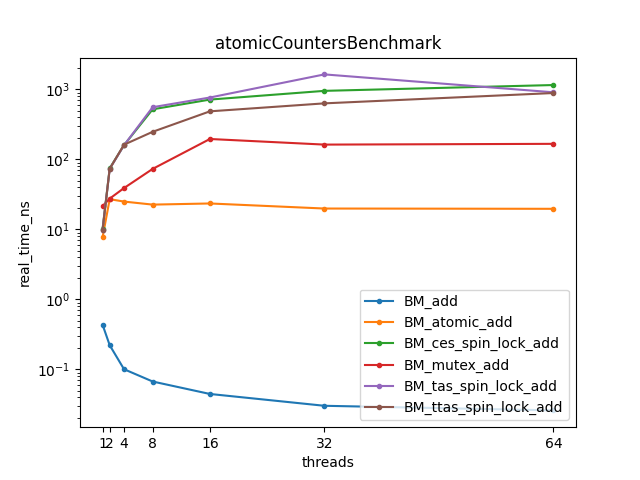
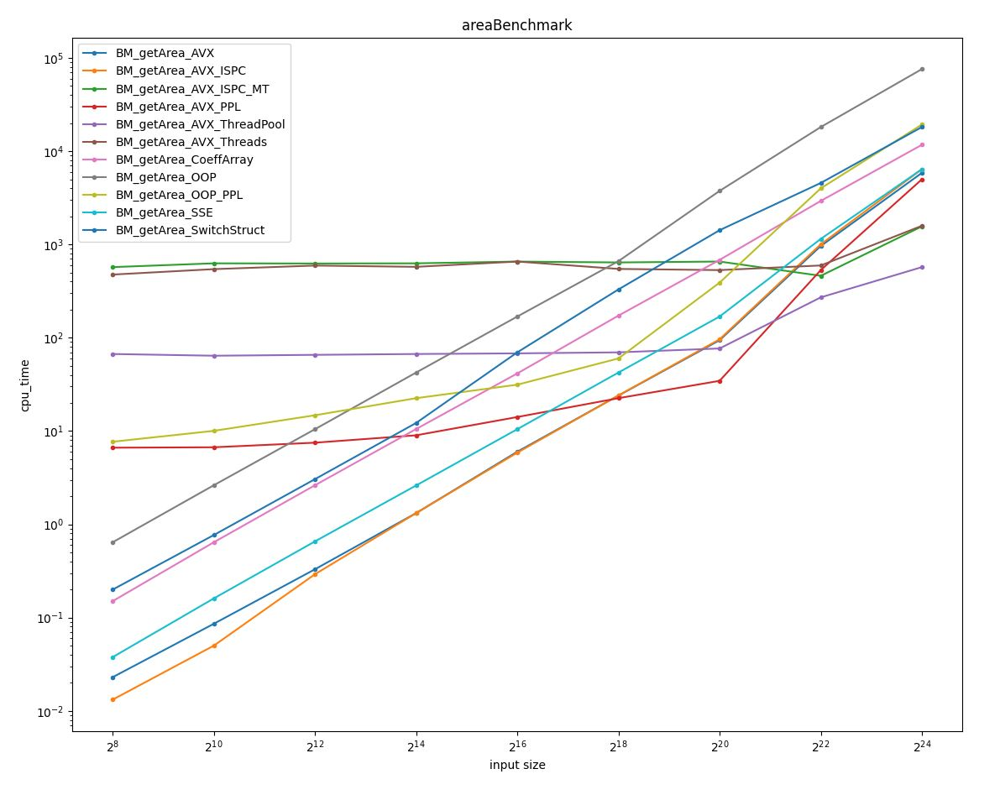

# computePlayground

Author: planet620

The idea behind this repository is to:
- Gather performance focused code snippets
- Compare computing techniques

### Cache benchmark
Inspired by [Gallery of Processor Cache Effects]. Shows how cache locality, cache misses, false sharing and instruction level parallelism can affect performance.
- Memory access: each element vs one element - it does not matter how many neighbouring elements from the array is modified, CPU reads the whole cache line anyway
- Instruction parallelism: chain of dependent instructions vs two independent instructions - the latter one is faster because instructions can be pipelined
- Cache levels: modifications applied to arrays of different sizes - measured time drops as array gets bigger and drops out of cache levels
  
### Atomic counters benchmark
Multiple threads incrementing one variable presented using a variety of locking techniques. Adding without the lock added as a referece - theoretical max. Atomic add is the fastest, mutex is order of magnitude slower. Last group is compare and swap, exchange and load, test and set, it performs equally good/bad.
The effect of a thread contention is visible for 16/32 cores (22 cores on the tested machine). 

### Area benchmark
Inspired by [Clean Code, Horrible Performance]. Shows how naive OOP approach differs in performance from other techniques. 
- Benchmarks:
  - Object oriented
  - Object oriented using PPL
  - Struct with switch statement
  - Array of coefficient
  - Vectorized with SSE
  - Vectorized with AVX
  - Vectorized with AVX512
  - Vectorized with ISPC (compiler set to use AVX instruction set)
  - Vectorized with ISPC (compiler set to use AVX instruction set) using task parallelism
  - Vectorized with AVX using threads
  - Vectorized with AVX using thread pool
  - Vectorized with AVX using PPL parallel transform
- For different input data sizes: 256, 512, 4096, 32768, 262144, 1048576 shapes
- Results:
    - OOP overhead is overwhelming
        - Switch statement immproves speed 3-4 times
        - Array of coefficients improves speed 4-6 times
        - Vectorization gives order of magnitude on top of that
    - For small datasets: Single threaded approaches are the fastest
        - Vectorized with ISPC is 50 times faster than OOP
    - For biggest datasets: Multi threaded solutions take over
        - PPL+AVX approach is 128 times faster than OOP
    - In general multithreading should be used for very big datasets, otherwise it has no sense
    - Using simple threads or ISPC task parallelism has very expensive overhead (thread creation)
        - Thread pool is 10 times faster than them
        - PPL is 20-140 times faster than them

### Dependencies

- Concurrent code uses Concurrency Visualizer
	- [Concurrency Visualizer SDK]
    - The follwoing steps arerequired
	- Menu: Extensions -> Manage Extensions -> Add: Concurrency Visualizer -> Restart VS 
    - Menu: Analyze -> Concurrency Visualizer -> Add SDK to project
- SIMD abstraction achieved with Intel SPMD Program Compiler [ISPC]
    - Add ispc.exe to PATH
	- Pre-Build Event is used to compile *.ispc programs.
- Performance measurement is done with [Google Benchmark]
    - Uninstall and install the NuGet package to avoid the "NuGet Restore" required issues

[//]: # (links)

   [Concurrency Visualizer SDK]: <https://learn.microsoft.com/en-us/archive/blogs/visualizeparallel/introducing-the-concurrency-visualizer-sdk>
   [Google Benchmark]: <https://github.com/google/benchmark>
   [Clean Code, Horrible Performance]: <https://www.youtube.com/watch?v=tD5NrevFtbU&ab_channel=MollyRocket>
   [ISPC]: <https://ispc.github.io/index.html>
   [Gallery of Processor Cache Effects]: <https://igoro.com/archive/gallery-of-processor-cache-effects/>